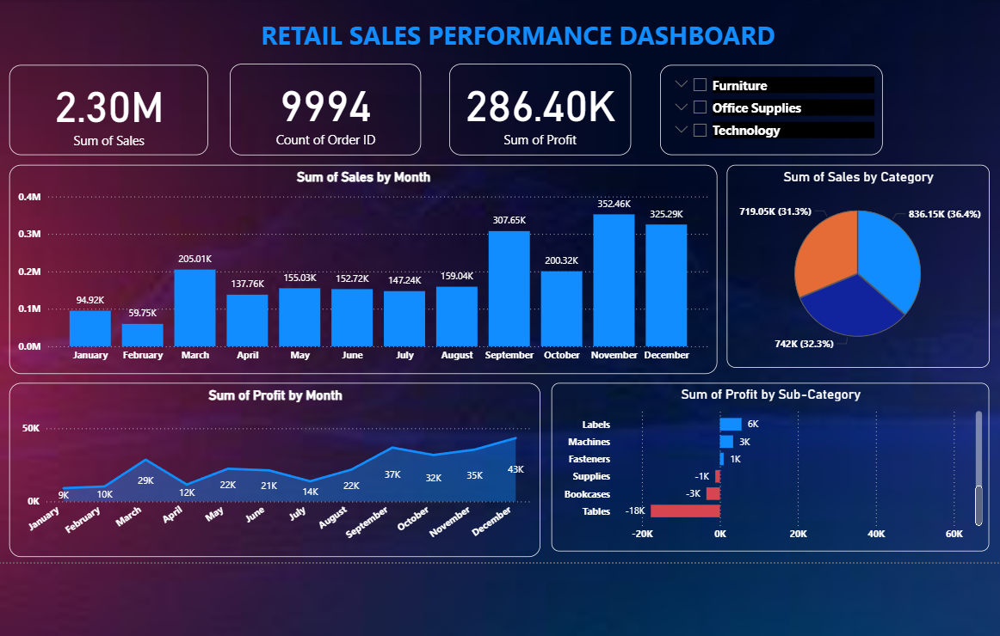

📊 Retail Sales Performance Dashboard

🔍 Overview
This project analyzes retail sales data using Power BI and SQL to uncover insights into sales trends, profitability, and category performance.

📈 Key Insights

Total Sales: 2.3M
Total Profit: 286K
Total Orders: 9994
Highest sales observed in November & December

📊 Dashboard Features

Monthly Sales Trend
Profit Trend Analysis
Category-wise Sales Distribution
Sub-category Profit Analysis
Interactive Filters

🛠 Tools & Technologies
Power BI
MySQL
SQL
Excel

📷 Dashboard Preview

🗄 SQL Queries
All SQL queries used for analysis are included in the repository.

🚀 Author

Shamanth S
